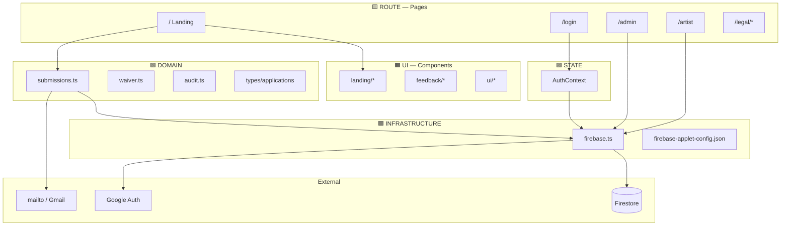
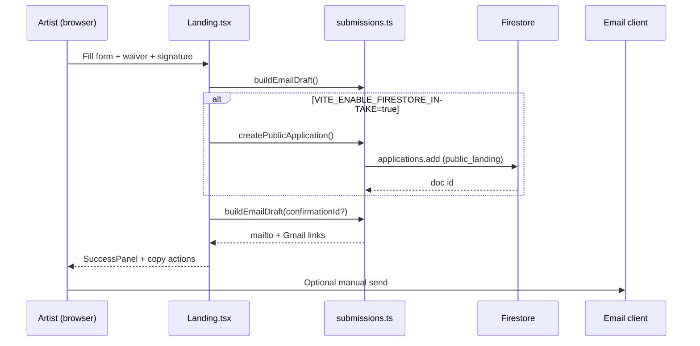
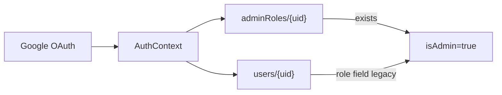

# Gig Quest — System Map

> **Read first:** [CONVENTIONS.md](./CONVENTIONS.md) for layer colors and header format.
> **Safe mode:** [LEGACY_SAFE_MODE.md](./LEGACY_SAFE_MODE.md)

---

## Executive Summary

| Aspect | Value |
|--------|-------|
| **Product** | Artist opportunity platform (pop-ups, showcases, open mics) |
| **Operator** | Creative Freq (`creativefreqllc@gmail.com`) |
| **Live path** | `/` → waiver → email fallback (Firestore intake **OFF** by default) |
| **Stack** | React 19, Vite 6, TypeScript, Tailwind 4, Firebase 12, React Router 7 |
| **Firebase project** | `gen-lang-client-0705859710` (see `firebase-applet-config.json`) |

---

## Layer Architecture



---

## Route Map (Source of Truth: `src/App.tsx`)

| Route | Layer | Component | Auth | Safe Mode |
|-------|-------|-----------|------|-----------|
| `/` | 🟨 ROUTE | `Landing` | Public | **LIVE** — intake + email fallback |
| `/login` | 🟨 ROUTE | `Login` | Public | Google sign-in |
| `/legal/terms` | 🟨 ROUTE | `LegalTerms` | Public | Static legal |
| `/legal/privacy` | 🟨 ROUTE | `LegalPrivacy` | Public | Static legal |
| `/legal/waiver` | 🟨 ROUTE | `LegalWaiver` | Public | Static legal |
| `/admin/*` | 🟨 ROUTE | `AdminDashboard` | Admin | Requires `adminRoles/{uid}` |
| `/artist/*` | 🟨 ROUTE | `ArtistDashboard` | Artist | Authenticated user |
| `*` | 🟨 ROUTE | `NotFound` | Public | 404 |

---

## Intake Flow (Public Landing)



**Gate:** `isFirestoreIntakeEnabled()` reads `import.meta.env.VITE_ENABLE_FIRESTORE_INTAKE === 'true'`.
Default: `false` in `.env.example`.

---

## Auth & Admin Model



**Security source of truth:** `firestore.rules` — client `isAdmin` is UX only.

---

## Firestore Collections

| Collection | Layer | Read | Write (client) |
|------------|-------|------|----------------|
| `applications` | 🟩 DOMAIN | Owner artist / admin | Public create (landing), artist portal create |
| `events` | 🟩 DOMAIN | Authenticated | Admin create/update |
| `users` | 🟪 STATE | Owner / admin | Owner create (artist role) |
| `adminRoles` | 🔴 SECURITY | Admin | Admin bootstrap only |
| `submissions` | 🟩 DOMAIN | Owner / admin | **Legacy** — artist auth |
| `auditLogs` | 🟩 DOMAIN | Admin | Admin create |
| `notifications` | 🟩 DOMAIN | Owner | Admin create |
| `waiverVersions` | 🟩 DOMAIN | Public read | Admin write |

Full schemas: [DATA_MODEL.md](./DATA_MODEL.md). Rules: `/firestore.rules`.

---

## Environment & Config

| File / Var | Layer | Purpose |
|------------|-------|---------|
| `firebase-applet-config.json` | 🟦 | Public web SDK config (not secret) |
| `.env.example` | 🟦 | Template; intake defaults OFF |
| `VITE_ENABLE_FIRESTORE_INTAKE` | 🔴 | Staging/prod intake gate |
| `firestore.rules` | 🔴 | Server-side authorization |

---

## Ops / Launch Pipeline

```txt
npm run launch:diagnose      → Firestore API reachable?
npm run launch:test-rules      → Public applications create allowed?
npm run launch:open-console    → Console tabs + rules clipboard
npm run launch:open-new-project→ New Firebase project wizard
npm run launch:apply-config    → Apply new firebase config JSON
npm run launch:verify          → CI + intake default + rules warn
npm run launch:deploy-rules    → firebase deploy (needs CLI login)
npm run launch:bootstrap-admin → adminRoles/{ADMIN_UID}
```

Details: [scripts/launch/README.md](../scripts/launch/README.md), [INTAKE_ENABLE_RUNBOOK.md](./INTAKE_ENABLE_RUNBOOK.md).

---

## Phase Status (Code Reality)

| Phase | Scope | Status |
|-------|-------|--------|
| 0 | Safety harness, tests | ✅ Merged |
| 1 | Repo truth, README | ✅ Merged |
| 2 | Router shell | ✅ Merged (`App.tsx` routes) |
| 3–10 | Applications, admin, artist, rules, legal | ✅ Merged |
| 11 | Launch ops scripts, firebase.json | ✅ Merged |
| 12A | Visual wow, landing split | ✅ Merged |
| 12B | Intake runbook, verify | ✅ Merged — **ops blocked** (Firestore API) |
| 14+ | Kanban, EPK, server XP | 🔲 Not started |

---

## Known Blockers

| Blocker | Symptom | Fix |
|---------|---------|-----|
| Firestore API disabled | `CONSUMER_INVALID` in `launch:diagnose` | Enable API + billing in GCP Console |
| Rules not published | `launch:test-rules` FAIL | Publish `firestore.rules` |
| No admin bootstrap | `/admin` empty / denied | Create `adminRoles/{uid}` |

---

## Related Docs

- [CODEBASE_INDEX.md](./CODEBASE_INDEX.md) — file-by-file index
- [AGENTS.md](../AGENTS.md) — AI assistant onboarding
- [LEGACY_SAFE_MODE.md](./LEGACY_SAFE_MODE.md) — landing non-negotiables
